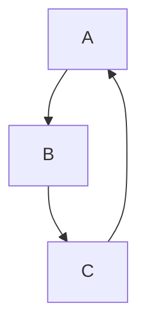
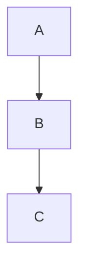

### 오류발생:
> 사내 업무중 변경된 소스를 배포하였고,<br>
Circular Reference 라는 오류를 faced했다

```
***************************
APPLICATION FAILED TO START
***************************

Description:

The dependencies of some of the beans in the application context form a cycle:

   appInstallLogServiceImpl (field com.infinigru.gruvoice.web.service.LoginService com.infinigru.gruvoice.web.service.AppInstallLogServiceImpl.loginService)
┌─────┐
|  loginServiceImpl (field com.infinigru.gruvoice.web.service.TcpipMessageService com.infinigru.gruvoice.web.service.LoginServiceImpl.tcpipMessageService)
↑     ↓
|  tcpipMessageServiceImpl (field com.infinigru.gruvoice.web.service.GfFdsService com.infinigru.gruvoice.web.service.TcpipMessageServiceImpl.gfFdsService)
↑     ↓
|  gfFdsServiceImpl (field com.infinigru.gruvoice.web.service.LoginService com.infinigru.gruvoice.web.service.GfFdsServiceImpl.loginService)
└─────┘


Action:

Relying upon circular references is discouraged and they are prohibited by default. Update your application to remove the dependency cycle between beans. As a last resort, it may be possible to break the cycle automatically by setting spring.main.allow-circular-references to true.

```

### 순환참조란?(Circular Reference) :
> 순환참조란 서로 다른 빈들이 서로 물고늘어져 계속연결되어있는것을 의미한다.


## 왜 발생할까? :
> 다음과 같은 이유로인해 Spring은 "Circular Reference" 라는 오류를 뱉는다.<br>
A, B, C 3개의 서로다른 클래스가 있다고 가정해보자.<br>
해당 클래스들은(어노테이션이 달린) Spring의 컴포넌트스캔에 의해 순차적으로 SpringContainer에 빈으로 등록되는데,  <br>
B는 A를, C는 B를, 다시 A는 C를 Autowired하고 있다면,<br>
Spring은 어떤 Bean을 먼저 생성해야할지 결정하지 못하고, 순환참조(Circular Refenrece) 오류에 직면하게 된다.<br>
그리고 이런 순환참조 오류가 발생했다는건 결국, <br>
"설계가 잘못되었으니, 설계를 다시해주세요 ~" 라는 의미가 내포되어있고,<br> 
이런 설계방식을 지양하라는 의미를 담고있다. 

## 해결방법 :
> 해결방법으로는 2가지 방법이있다.<br>
첫번째는 아래에 있는 예제를 통해 재설계하는방법.<br>
두번째는 스프링부트에서 제공하는 옵션을 순환참조에대해 허용해주는 방법이다. 
### 1. 재설계
> 아래에 있는 그림으로 설계를 다시해 서로 물고늘어져있는 매듭을 정리한다.  

### Before:


### After:


### 2. 옵션지정(스프링부트)
> application.yml에 아래옵션을 통해 순환참조에 대해 허용. 
```yaml
spring.main.allow-circular-references=true
```
